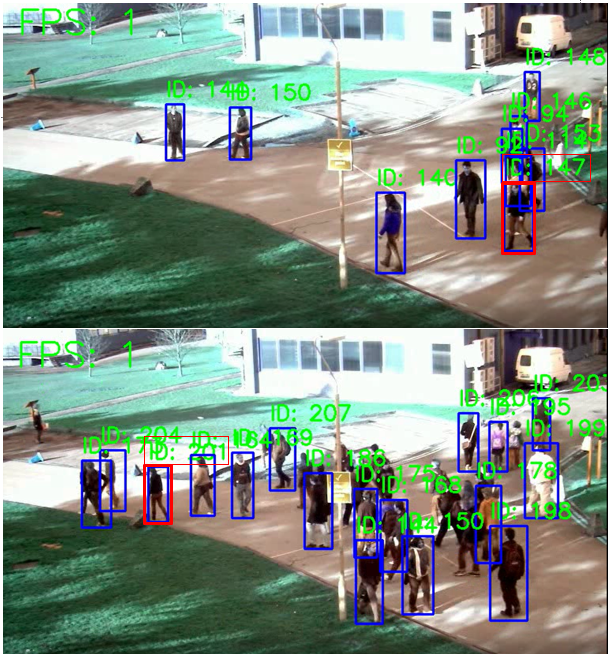
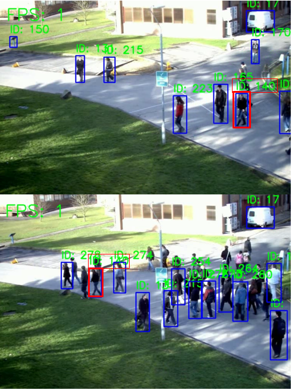
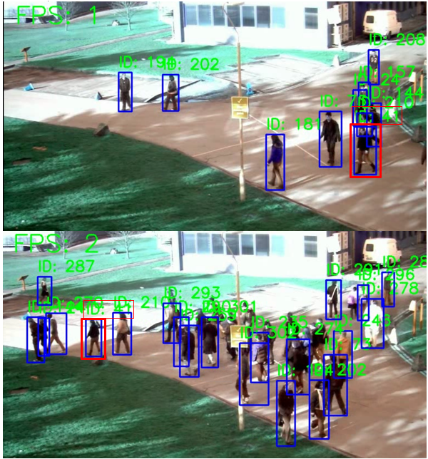

# Overview

Object tracking involves identifying and following objects across frames in a video. The primary challenge in object tracking is to maintain the identity of objects over time despite occlusions, changes in appearance, and motion. In this GitHub repository, we explore and compare the performance of three object tracking algorithms: SORT, DeepSORT, and StrongSORT++. SORT is a fast and simple tracking algorithm that doesn't use deep learning, while DeepSORT and StrongSORT++ are more advanced algorithms that use deep learning to improve tracking accuracy and robustness.

# Tracking Results of the Algorithms

  <strong>SORT tracking result</strong>
   
  

  <strong>DeepSORT tracking result</strong>
   
  

  <strong>StrongSORT++ tracking result</strong>
   
  

StrongSORT++ Tracking on Traffic Data

  <strong>StrongSORT++ tracking result</strong>
   
  

# Comparison results

I compared the tracking performance of three algorithms on a crowd scene of people walking. I noticed that DeepSORT and StrongSORT++ track people more precisely, with fewer ID switches. In contrast, SORT showed more ID switches, indicating less reliable tracking in situations with occlusions.

<!-- 

 -->

  <strong>SORT tracking result</strong>
   
  

  <strong>DeepSORT tracking result</strong>
   
  

  <strong>StrongSORT++ tracking result</strong>
   
  

For datasets like the traffic GIF above, their performance is similar. One interesting observation is that both StrongSORT++ and SORT switched IDs when two cars passed another car, while DeepSORT only switched the ID for one car. 

  <strong>SORT tracking result</strong>
   
  

  <strong>DeepSORT tracking result</strong>
   
  

  <strong>StrongSORT++ tracking result</strong>
   
  

In terms of speed (fps), I ran my code on a CPU and didn't observe a significant difference in frame rate. However, SORT was still faster than both DeepSORT and StrongSORT++, even on the CPU.

# General Object Tracking Process

1- **Detection**: Identify objects in each video frame using an object detection algorithm (here Yolov8).

2- **Initialization**: Assign a unique ID to each detected object to start tracking.

3- **Prediction**: Predict the object's future position using a model like the Kalman filter.

4- **Data Association**: Match detected objects in new frames with existing predicted tracks to maintain their identity using a model like Hungarian algorithm.

5- **Update**: Update each tracked object's state based on new information using Kalman filter.

6- **Track Management**: Start new tracks for new detections, update matched tracks, and delete or age out missing tracks.

# DeepSORT Object Tracking Process
DeepSORT extends SORT algorithm by incorporating appearance information to enhance tracking performance.

1- **Detection**: Identify objects in each video frame using an object detection algorithm (here Yolov8).

2- **Initialization**: Assign a unique ID to each detected object to start tracking.

3- **Prediction**: Predict the object's future position using a model like the Kalman filter.

3- **Appearance Feature Extraction**: For each detected object, a deep appearance descriptor (typically a pretrained CNN) is used to extract appearance features.

 3-1 The extracted appearance features are stored in a feature bank for each tracklet. The feature bank typically retains features from the last 100 frames

 3-2 **Cosine Similarity Calculation**:The cosine similarity (or cosine distance) between the features of new detections and the stored features in the feature bank is calculated. This similarity score is used to measure the appearance-based matching cost.

4- **Data Association**: Match detected objects in new frames with existing predicted tracks to maintain their identity using a model like Hungarian algorithm.

 4-1 **Both appearance and motion information** are used to associate new detections with existing tracklets.
 The matching cost matrix is created using the appearance-based matching cost (cosine similarity) and motion-based matching cost (IOU)

5- **Update**: Update each tracked object's state based on new information using Kalman filter. Update the appearance features using the feature bank mechanism.

6- **Track Management**: Start new tracks for new detections, update matched tracks, and delete or age out missing tracks.

# StrongSORT++ Object Tracking Process

StrongSORT++ further enhances the StrongSORT algorithm by addressing two key issues in multi-object tracking: missing associations and missing detections.

1- **Detection**: Identify objects in each video frame using an object detection algorithm (here Yolov8).

2- **Initialization**: Assign a unique ID to each detected object to start tracking.

3- **Prediction**: Predict the object's future position using a model like the Kalman filter.

3- **Appearance Feature Extraction**: Extract appearance features for each detected object using an advanced feature extractor such as BoT (Bag of Tricks).

4- **Camera Motion Compensation**: Apply the Enhanced Correlation Coefficient (ECC) model to compensate for camera motion. This step adjusts the predicted positions to account for any camera movement between frames.

5- **Matching Cost Calculation**: 
- Calculate the appearance-based matching cost using the cosine similarity between the appearance features of new detections and stored features. 
- Calculate the motion-based matching cost using the Mahalanobis distance between the predicted positions of existing tracklets and the new detections.
- Combine the appearance and motion costs into a single cost matrix, weighted appropriately.

6- **Data Association**: Match detected objects in new frames with existing predicted tracks to maintain their identity using a model like Hungarian algorithm.

7- **Update**: Update each tracked object's state based on new information using Kalman filter. Use the Exponential Moving Average (EMA) strategy to update appearance features, reducing sensitivity to detection noise.

8- **Appearance-Free Link (AFLink)**: For unresolved associations, use AFLink to predict the connectivity between tracklets without relying on appearance features. AFLink uses spatiotemporal information to link tracklets that are likely to belong to the same object.

9- **Gaussian-Smoothed Interpolation (GSI)**: Apply GSI to handle missing detections. GSI uses Gaussian process regression to smooth the trajectories of objects, filling gaps where detections are missing and providing more accurate and stable positions.

10- **Track Management**: Start new tracks for new detections, update matched tracks, and delete or age out missing tracks.

## Repository Structure

- `models/`: Contains model configurations and weights for YOLOv8
- `scripts/`: Python scripts for tracjking, evaluation, and utility functions.
- `results/`: Stores the results of the comparison study.

### Prerequisites

- Python 3.8 or higher
- PyTorch

# References

- [Yolov7-Strongsort++](https://github.com/madara-tribe/Yolov7-StrongSORT-PlusPlus/tree/main?tab=readme-ov-file)
- [StrongSORT: Make DeepSORT Great Again](https://ai-scholar.tech/articles/object-tracking/strongsort)

